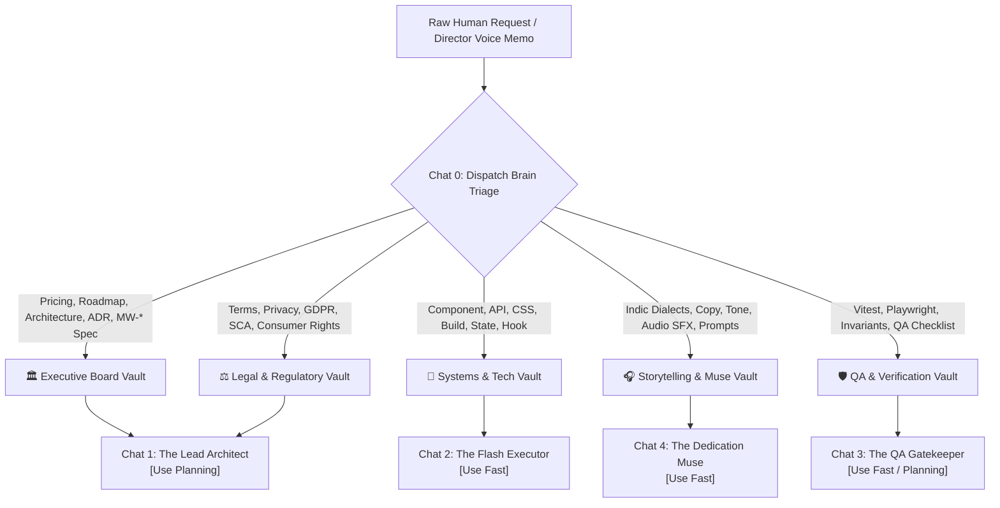

# 🧭 NotebookLM ⇄ Antigravity 5-Way Knowledge Routing Protocol & Matrix

**Initiative:** MW-233 Platform Operations & Agentic Governance  
**Sprint:** Sprint 3 (Active)  
**Root Path:** `C:\Users\home\studio`  
**Constitutional Governance:** `C:\Users\home\studio\.agents\AGENTS.md` (Rules 5, 7, 20, 26, 34, 36, 37)  
**Historical Anchor:** The pinned thread `Heirloom Gifting Engine Architecture` is preserved as the permanent design log for Act V.

---

## 1. Executive Summary & Operational Thesis

The Memory Weaver platform operates across five specialised departmental NotebookLM knowledge vaults and five dedicated Antigravity pinned chat sessions. Without a formal, bi-directional routing protocol, multi-agent systems suffer from context drift, token bloat, conflicting architectural decisions, and fragmented documentation.

This protocol establishes **`Chat 0: Mission Control (The Dispatch Brain)`** as the central triage gateway and prompt firewall:
1. **Downstream (Dispatch Protocol):** Ingests raw input (voice memos, feature briefs, bug reports, and user feedback), identifies the authoritative NotebookLM vault, mandates the operational execution mode (`[Use Planning]` or `[Use Fast]`), and generates precision-scoped prompts targeting a specific pinned Antigravity thread with absolute file paths (`C:\Users\home\studio\...`).
2. **Upstream (Grounding Protocol):** Ensures that completed code refactors, verified test suites, legal policies, and architectural decisions are codified back into their designated NotebookLM vault via the automated manifest script (`npm run sync:vault-manifest`).

---

## 2. The 1:1 Operational Routing Matrix

| NotebookLM Grounding Vault | Authoritative Scope & Domain Knowledge | Target Antigravity Pinned Thread | Mandated Operational Mode | Target Codebase Files (Absolute Paths) |
| :--- | :--- | :--- | :---: | :--- |
| 🏛️ **Executive Board & Architecture** | Financial models, £195 heirloom / £12.99 monthly pricing, Sprint roadmaps, Architecture Decision Records (ADRs), multi-generational commercial thesis. | `Chat 1: The Lead Architect` | **`[Use Planning]`** | `C:\Users\home\studio\docs\*.md`<br>`C:\Users\home\studio\MISSION_LOG.md`<br>`C:\Users\home\studio\.agents\AGENTS.md` |
| 📐 **Systems, Tech & Codebase** | Next.js 15 App Router, Firestore rules & schemas, Cloud Run, App Hosting, Edge Middleware, React components, Tailwind styling, Web Audio synthesis, builds. | `Chat 2: The Flash Executor` | **`[Use Fast]`** | `C:\Users\home\studio\src\app\*`<br>`C:\Users\home\studio\src\components\*`<br>`C:\Users\home\studio\src\lib\*`<br>`C:\Users\home\studio\src\hooks\*` |
| ⚖️ **Legal, Regulatory & SCA** | Section 6 Hardware & Technical Terms, UK Consumer Rights Act 2015, Stripe Strong Customer Authentication (SCA), GDPR / Data Protection, refund & cancellation covenants. | `Chat 1: The Lead Architect` | **`[Use Planning]`** | `C:\Users\home\studio\src\app\legal\terms\page.tsx`<br>`C:\Users\home\studio\src\app\legal\privacy\page.tsx`<br>`C:\Users\home\studio\firestore.rules` |
| 🎧 **Storytelling, Indic Dialects & Prompts** | Gujarati (`ગુજરાતી`), Punjabi (`ਪੰਜਾਬੀ`), and Hindi (`हिन्दी`) cultural dedications & salutations, Web Audio wax-seal crack SFX, prompt spark engine, British English orthography standards. | `Chat 4: The Dedication Muse & Copy Critic` | **`[Use Fast]`** | `C:\Users\home\studio\src\config\businessRules.ts`<br>`C:\Users\home\studio\src\lib\audio\*`<br>`C:\Users\home\studio\src\lib\dedicationMuse.ts` |
| 🛡️ **QA, Invariants & Verification** | Vitest automated regression shields, Native Playwright staging smoke tests, `/api/version` edge deployment polling, interactive QA verification artifacts (`qa_checklist_interactive.html`). | `Chat 3: The QA Gatekeeper` | **`[Use Fast]`** / **`[Use Planning]`**<br>*(Fast for invariant suites; Planning for new E2E architectures)* | `C:\Users\home\studio\src\test\*`<br>`C:\Users\home\studio\qa_checklist_interactive.html`<br>`C:\Users\home\studio\scripts\generate_qa_checklist.js` |

*Historical Design Log Reference:* The pinned conversation `Heirloom Gifting Engine Architecture` is locked and preserved as the immutable design log for Act V.

---

## 3. Keyword Triggers & Resolution Paths

Chat 0 parses incoming queries against the following keyword dictionary to immediately resolve the authoritative vault and target chat:



### 3.1 Keyword Triggers Table

| Authoritative Vault | Primary Keyword Triggers | Secondary & Contextual Triggers | Target Thread |
| :--- | :--- | :--- | :--- |
| 🏛️ **Executive Board & Architecture** | `pricing`, `commercial thesis`, `roadmap`, `sprint`, `ADR`, `tier`, `revenue`, `MW-* spec`, `architecture design` | `business model`, `heirloom pass`, `unboxing ceremony spec`, `financial projection`, `gift voucher economics` | `Chat 1: The Lead Architect` |
| 📐 **Systems, Tech & Codebase** | `component`, `hook`, `page`, `route`, `api`, `firestore schema`, `tailwind`, `build`, `compilation`, `refactor`, `bug fix` | `Next.js App Router`, `Cloud Run`, `App Hosting`, `React state`, `TypeScript compilation`, `edge routing`, `CSP` | `Chat 2: The Flash Executor` |
| ⚖️ **Legal, Regulatory & SCA** | `Section 6`, `hardware terms`, `consumer rights`, `GDPR`, `Stripe SCA`, `refund`, `cancellation`, `liability`, `statutory` | `privacy policy`, `cookie consent`, `terms of service`, `cooling-off period`, `data retention`, `regulatory compliance` | `Chat 1: The Lead Architect` |
| 🎧 **Storytelling, Indic Dialects & Prompts** | `Gujarati`, `Punjabi`, `Hindi`, `Indic script`, `dedication`, `muse`, `wax seal audio`, `crack SFX`, `soundtrack`, `copy`, `tone` | `prompt spark`, `monologue`, `orthography`, `salutation`, `Noto Sans Indic`, `audio context`, `procedural audio` | `Chat 4: The Dedication Muse & Copy Critic` |
| 🛡️ **QA, Invariants & Verification** | `test`, `vitest`, `playwright`, `regression`, `invariant`, `qa checklist`, `verification`, `edge poll`, `/api/version`, `audit` | `smoke test`, `visual diff`, `headless browser`, `staging gate`, `test coverage`, `mobile viewport assertion` | `Chat 3: The QA Gatekeeper` |

---

## 4. Downstream Dispatch Protocol (Chat 0 Standard)

When `Chat 0 Mission Control (The Dispatch Brain)` generates an execution prompt, it MUST adhere strictly to the following mandatory structural invariants:

1. **Header Identification:**
   - Must declare **Authoritative NotebookLM Vault**.
   - Must declare **Exact Target Pinned Thread Name**.
   - Must declare **Mandated Operational Mode** (`[Use Planning]` or `[Use Fast]`).
2. **Absolute File Paths Only:**
   - Every file reference MUST use the fully-qualified Windows path starting with `C:\Users\home\studio\...`.
   - Never use relative paths (`src/app/...`) or truncated placeholders (`...`).
3. **Mandatory Invariant Rule Injections:**
   - **Rule 20 (British English Orthography):** All user-facing text, copy, comments, and identifiers must use UK English (e.g. *Colour*, *Organise*, *Centre*, *Theatre*, *Realise*, *Synthesise*, *Behaviour*, *Minimise*).
   - **Rule 5 (Staging-Only Rollout Gate):** All user-facing validation must target `https://dev.memoryweaver.studio/` after a successful `npm.cmd run build` compilation exit code 0.
   - **Rule 7 (Universal Non-Degradation):** Existing visual feedback loops, user capabilities, or hardware loopbacks must never be silently removed or degraded.
   - **Rule 34 / 36 (Testing Rigour):** Invariant unit testing in Vitest and headless visual regression across Mobile (360px), Tablet (820px), and Desktop (1440px) in Playwright.

---

## 5. Upstream Grounding Protocol (NotebookLM Sync Standard)

When development, architectural refactoring, legal adjustments, or QA sign-offs conclude in `C:\Users\home\studio`:

1. **Execution of Manifest Check:**
   ```powershell
   npm run sync:vault-manifest
   ```
2. **Evaluation of Changed Artifacts:**
   The script inspects tracked files across `docs/`, `src/app/legal/`, `MISSION_LOG.md`, `.agents/`, and test summaries, grouping them by target NotebookLM vault and highlighting un-ingested changes.
3. **Vault Ingestion:**
   The team or automated tool copies the updated Markdown or text contents into the corresponding NotebookLM vault, ensuring the Strategic Brain remains 100% synchronized with the live codebase.

---

## 6. Strict British English (UK) Orthography Compliance (Rule 20)

All documents, prompt templates, and dispatches produced under this protocol MUST strictly adhere to British English orthography:

| Disallowed (US) | Mandated (UK) | Context / Example |
| :--- | :--- | :--- |
| `Color` | `Colour` | Colour grading, Colour tint, Hex colour code |
| `Favorite` | `Favourite` | Favourite prompt, Favourite keepsake |
| `Center` | `Centre` | Optical centre, Prompter centre |
| `Theater` | `Theatre` | Theatre View, Theatrical unboxing |
| `Realize` / `Realized` | `Realise` / `Realised` | Realised intent, Realise audio context |
| `Synthesize` / `Synthesizer` | `Synthesise` / `Synthesiser` | Synthesise monologue, Procedural synthesiser |
| `Behavior` | `Behaviour` | Component behaviour, Playwright user behaviour |
| `Minimize` | `Minimise` | Minimise bundle size, Minimise window |
| `Formalize` | `Formalise` | Formalise protocol, Formalise contract |
| `Program` *(non-code)* | `Programme` | Memoir programme, Gifting programme |
